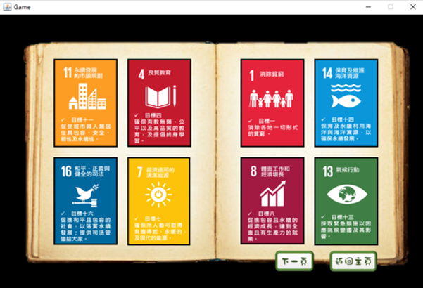

# Mahjong with SDG and Taiwanese Snacks

## Overview

This project is a Java-based implementation of the traditional Taiwanese game "Mahjong," developed using object-oriented programming (OOP) principles. It features a graphical user interface (GUI) built with Java Swing and integrates educational elements inspired by the Sustainable Development Goals (SDGs) alongside cultural highlights of Taiwanese snacks. The goal is to create an entertaining yet educational experience for players.

## Game Rules

### Deck Composition
- **Total Cards**: 136 cards (excluding flower cards).
- **Suits**: Four types—Bamboo (條), Characters (萬), Dots (筒), and Honors (字).

### Player Hands
- **Hand Cards**: Cards held by the player.
  - **Open Cards (明牌)**: Cards revealed to others (from "Chi" or "Pong").
  - **Hidden Cards (暗牌)**: Cards unseen by other players.
  - **Discard Pool (牌池牌)**: Cards discarded from the hand.

### Turn Order
- Starts with the player in the East Wind position, proceeding counterclockwise.

### Gameplay
- Each turn, a player:
  1. Draws one card from the deck.
  2. Discards one card from their hand.
- After each turn, the player’s hand should contain **16 cards**.

### Winning (胡牌)
- A player wins by forming more than three sets (at least 9 cards) of:
  - **Sequence (順子)**: Three consecutive cards of the same suit.
  - **Triplet (刻子)**: Three identical cards.

### Actions
- **Chi (吃牌)**: Take the previous player’s discard to form a sequence.
- **Pong (碰牌)**: Take any player’s discard to form a triplet.
- **Draw (流局)**: If the deck runs out, the round ends with no winner.

## Game Features

### SDG Integration
- **SDG Cards**: Players collect SDG-themed cards in a gallery.
- **Trigger**: When a player performs a "Chi" or "Pong," an SDG card slideshow appears, allowing the player to click and draw a card.

### Taiwanese Snacks
- **Snack Cards**: Players earn cards featuring Taiwanese snacks in a gallery.
- **Trigger**: Upon winning (胡牌), a random snack card pops up.

## Technical Details
- **Language**: Java
- **Framework**: Java Swing for GUI
- **Design**: Object-oriented programming (OOP)
- **Purpose**: Combines entertainment with education about SDGs and Taiwanese culture.

## Requirements
- Java Development Kit (JDK) 8 or higher
- IDE (e.g., IntelliJ IDEA, Eclipse) for compilation and running

## Setup Instructions
1. **Clone the Repository**:
```bash
git clone https://github.com/alexliu0121/Mahjong.git
cd Mahjong
```
2. **Compile and Run**:
- Compile the project:
```bash
javac *.java
```
- Run the game:
```bash
java Main
```
(Replace `Main` with your main class name if different.)

## Usage
- Launch the game using the command above.
- Follow the turn-based rules to draw, discard, and form sets.
- Perform "Chi" or "Pong" to collect SDG cards.
- Win rounds to unlock Taiwanese snack cards.

## Playing Showcases
Below are some screenshots showcasing the gameplay. Click to enlarge:

  
*Caption: The home page for this game.*

  
  
*Caption: The collection pages that shows all your collected SGDs cards and snack cards*

  
*Caption: The main game interface with player hand and discard pool.\ The blue circle indicates the drawing card.*
  
*Caption: The blue arrow indicates the card you want to discard.*
  
*Caption: The blue circle indicates the card you discarded and that's all your moves for one round.*
  
*Caption: If there's any cards that was discarded by other players you can 'Pong', the button will show up. *
  
*Caption: Once you clicked the 'Pong' button, the melded cards will be displayed in grayscale above the hand cards.*
  
*Caption: If a card discarded by another player can be used for a "Chi," a "Chi" button will be displayed.*
  
*Caption: After pressing "Chi," the eaten cards will be displayed in grayscale above the hand cards.*
  
*Caption: When a player presses the "Chi" or "Pong" button, a random SDG introduction card will be drawn.*
  
*Caption: When the accumulated "Chi" or "Pong" cards reach three sets, the player can win (胡牌) and receive a gourmet card.*


## Learning Outcomes
- Applied OOP concepts to structure a complex game.
- Designed an interactive GUI with Java Swing.
- Integrated educational content (SDGs) and cultural elements (Taiwanese snacks) into gameplay.

## Acknowledgments
- Developed as a personal project inspired by traditional Mahjong.
- Incorporates Sustainable Development Goals for educational value.
